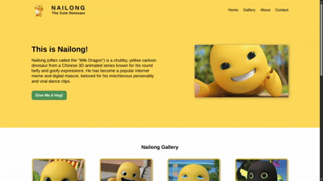
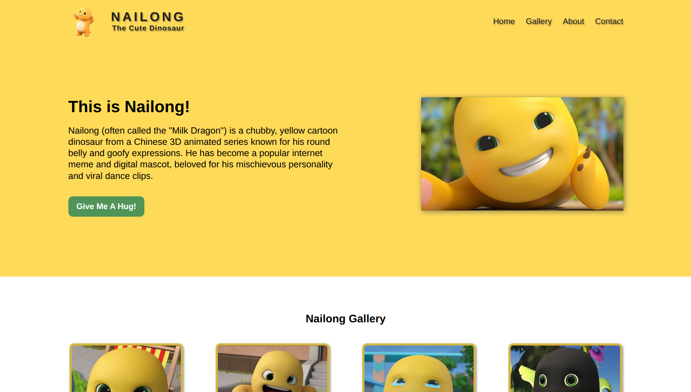
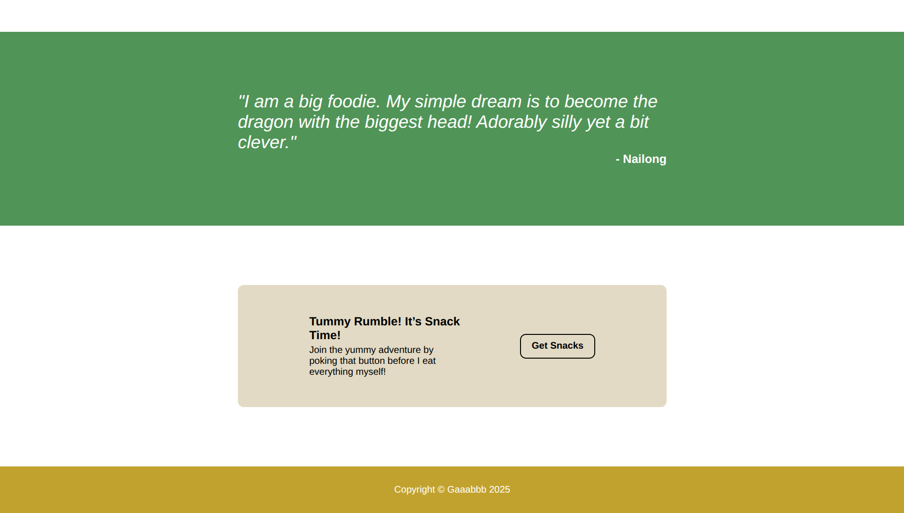

<h1 align="center">Nailong Landing Page</h1>
<h3 align="center"><a href="https://gaaabbb.github.io/nailong-landing-page/">🎥 Live Demo</a></h3>

  

## 📜 Description
A clean, static landing page built as part of **The Odin Project** curriculum. The primary goal of this project was to demonstrate foundational HTML and CSS skills, with a heavy focus on mastering the **Flexbox** layout model.

## ✏️ Features
- **Static Content:** A focused, distraction-free landing page.
- **Flexbox Mastery:** Custom-built navigation, hero section, and image grids using Flexbox logic.
- **Clean UI:** Styled in accordance with modern design principles provided by the assignment.

> [NOTE]  
> This project was built as a desktop-first exercise. It is currently a static website and is not optimized for mobile responsiveness.

## 🖼️ Preview
#### Page Up

#### Page Down

## 🛠️ Built With
* **HTML5**
* **CSS3**

## ©️ Credits
**Hero Image:** https://www.facebook.com/61550565304283/posts/everyone-let-me-introduce-yall-to-nailong-hes-a-cutie-dino-/122248029818018843/

**Gallery Images:**
* https://ph.pinterest.com/pin/25684660371322004/
* https://ph.pinterest.com/pin/844493675119891/
* https://ph.pinterest.com/pin/71002131620873808/
* https://ph.pinterest.com/pin/127648970684560154/

> [NOTE]  
> *I don't own any of the the pictures and fonts used in this website. The rights for the materials I used belong to the respective authors, aritsts, and publishers.*

## 👤 Author
- **Gaaabbb** - [GitHub Profile](https://github.com/gaaabbb)